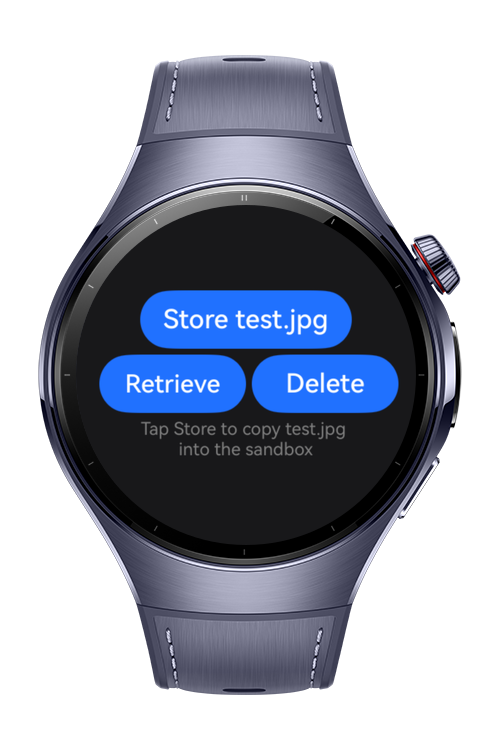
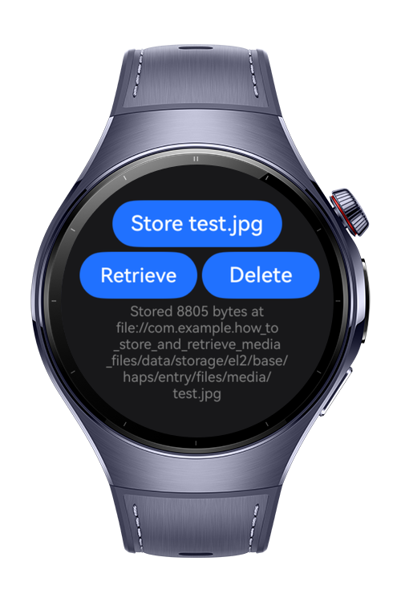
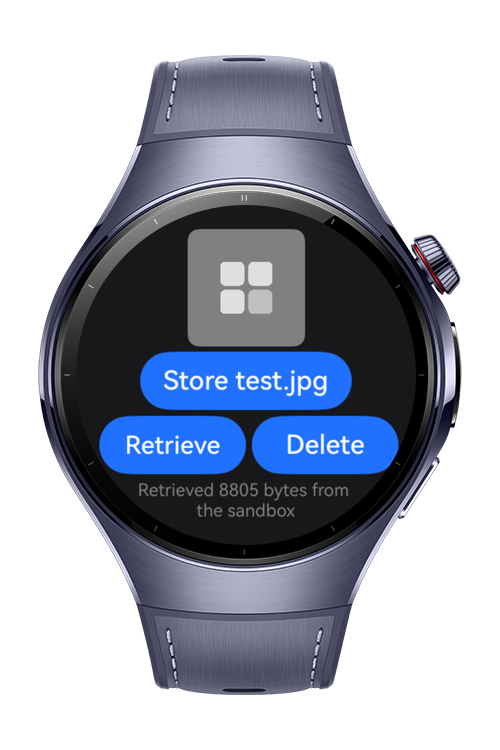
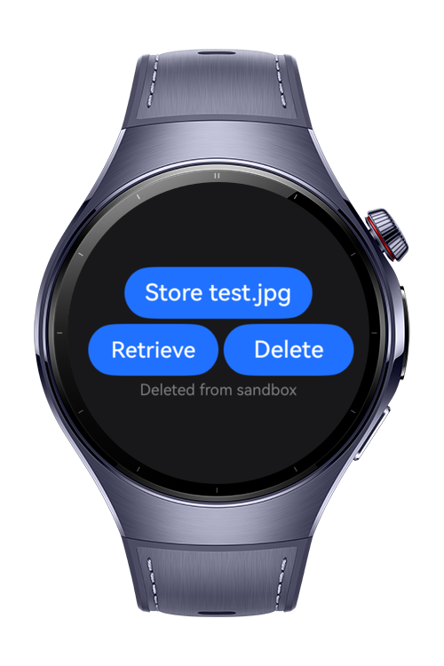

> **Note:** To access all shared projects, get information about environment setup, and view other guides, please visit [Explore-In-HMOS-Wearable Index](https://github.com/Explore-In-HMOS-Wearable/hmos-index).

# How to Store and Retrieve Media Files
This sample showcases how to handle media files in the app's own application sandbox. It showcases how to implement store, retrieve and delete operations.

# Preview
<div>
  
  
  
  
</div>

# Use Cases
- Applications with media files (files such as jpg, mp3, mp4 etc).
- Applications that need a way to store media files locally and retrieve on demand.

# Tech Stack
- **Language:** ArkTS
- **Framework**: HarmonyOS SDK 6.0.0(20)
- **Tools** DevEco Studio 6.1.1 Release
- **Libraries**:
  - **Core File Kit:** `fileIo, fileUri` used for file operations on media files.
  - **Ability Kit:** `common` used to access the necessary context.

# Directory Structure
```
entry/src/main/
├── ets/
│   ├── pages/
│   │   └── Index.ets                # Main Demo Page to showcase media store and retrieve
│   └── storage/ 
│       └── FileStore.ets            # File Storage Manager
├── module.json5
└── resources/
    ├── base/
    └── rawfile/
        └── test.jpg                 # A test media file
```

# Constraints and Restrictions
## Supported Devices
- Huawei Watch 5/6
- Huawei Watch Kids X1
- DevEco Studio Simulator

# LICENSE
**How to Store and Retrieve Media Files** is distributed under the terms of the **MIT License**.
See the [LICENSE](/LICENSE) for more information.
